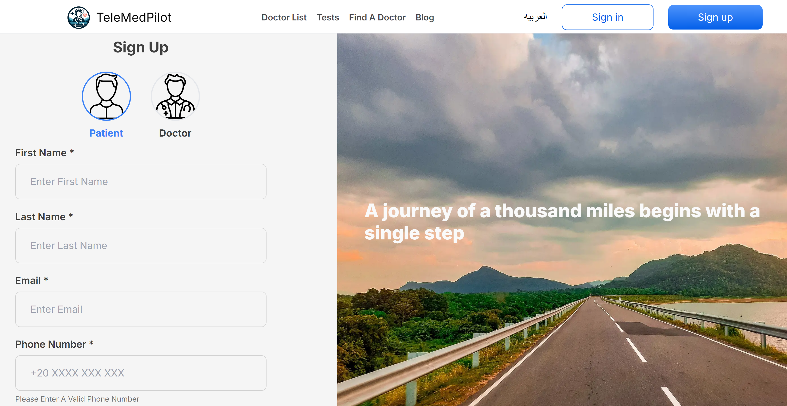

# Telemedicine Web App

## Live Demo
https://telemedicine-mansy.vercel.app/

## Description

- A Telemedicine Platform (Shezlong Clone) Designed To Connect Patients With Certified Doctors Via Secure Online Consultations.
- Simplifies Providing Healthcare Serivces By Offering Features Such As Appointment Booking, Scheduling Follow Ups, Medical Record Management.
- Allows Doctors To Input Free Time Slots Indicating Availablity For An Appointment.
- Introduces Review & Rating System Between Patients And Doctors.

## Tech Stack Used

|**Front End** |  |
|--- | --- |
|**Styling** |  |
|**Back End** |  |
|**Database** |  |
|**Deployment** |  |

## Features

- Simple Patient & Doctor Registeration
   

- Intuitive Doctors Filtering

- Dynamic Availablity Scheduling
  

- Flexible Appointment Booking

- Doctor Rating System
  

## How It Works
1. **Create An Account:** Sign Up And Set Up Your Profile.
   
2. **Book An Appointment:** Search For Doctors And Choose a Suitable Time For You.
   
3. **Consult Online:** Meet With Your Doctor Via Video Or Phone.
   
4. **Receive Treatment:** Get A Diagnosis And Personalized Treatment Plan.
   
5. **Access Medical Records:** Safely Manage Your Prescriptions And Visit History Online.

## Contributors

| Name | GitHub | LinkedIn |
| ---- | ------ | -------- |
| Mostafa Ayman |  |  |
| Yahya Alariny |  |  |
| Assem Sadek |  |  |
| Mahmoud Mansy | |  |
| Youssef Hassanien |  |  |
| Ahmed El Deeb | |  |
| Amr Safwat | |  |
